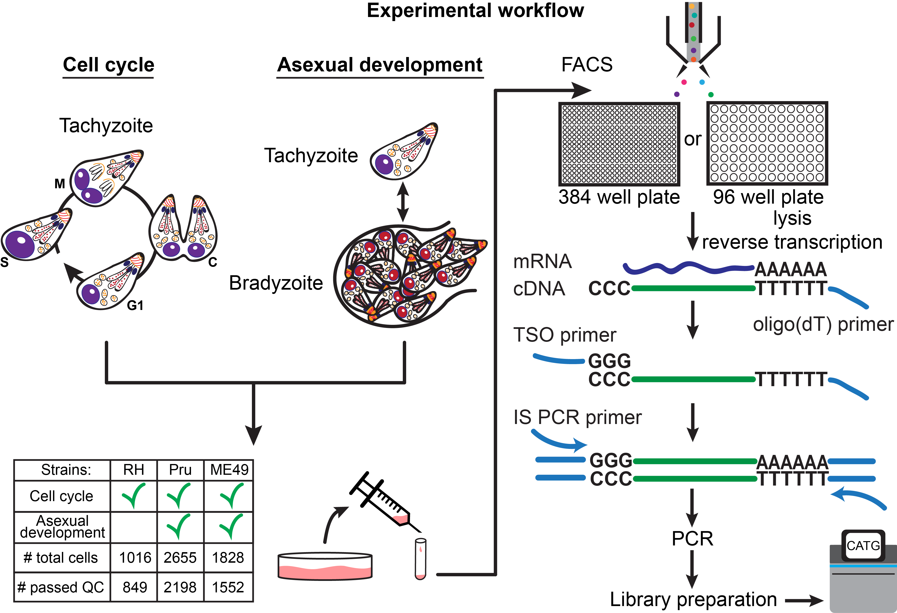

# singleToxoplasmaSeq

About
---------------------
This respository includes scripts and jupyter notebooks used to re-generate analysis results of ["A single-parasite transcriptional atlas of Toxoplasma gondii reveals novel control of antigen expression" (2020)](https://www.biorxiv.org/content/10.1101/656165v1?rss=1).



Interactive atlas
-----------------
We have also generated an interactive browser to visualize our scRNA-seq dataset. [Visit here](http://st-atlas.org)


How to use
----------
Git clone this repository:
```bash
git clone https://github.com/xuesoso/singleToxoplasmaSeq
```

Then download the bundled scripts and data to the repository folder in order to regenerate analysis results and figures.
```bash
wget https://drive.google.com/file/d/1-lMhILWM8xLrLRul0YFO3_4Tvij5xVeV/view?usp=sharing
tar -xvf Submission_analysis.tar.gz
```

Data can also be downloaded by clicking this button

<p>
<a href="https://drive.google.com/file/d/1-lMhILWM8xLrLRul0YFO3_4Tvij5xVeV/view?usp=sharing" download>Download data</a>
</p>


**Optional:**
Assuming that one has [anaconda distribution](https://www.anaconda.com/distribution/) of python, create an environment for python 3.6.8 (should work on python 3.6+).
```bash
conda create -n toxoSeq python=3.6.8 ipykernel
conda activate toxoSeq
```

**Optional:**
If you just set up a new conda environment, you may need to set up the jupyter kernel as well in order for jupyter notebook to run on this backend.
```bash
python -m ipykernel install --user
```

Now, install all the required python libraries.
```bash
pip install requirements.txt
```

Lastly, you can now open up the jupyter notebook and run each cell to regenerate the analysis results.
```bash
jupyter-notebook Scripts/figures.ipynb
```

**Data description:** See "data_description.csv" for a description of the data files in Submission_analysis/Data/


<details><summary> What is in "Scripts/" </summary>
<p>

```
--Scripts ----> figures.ipynb : Jupyter notebook to regenerate figures and analysis results.
    |
    |-------> _loadlib ---> utils/ : A list of utility plotting and analysis functions required. Imported library call name is "sat"
    |           |
    |           |-------> rh07.py : Library and variable definitions for RH (rh07; 384-well) dataset analysis.
    |           |
    |           |-------> me49_011.py : Library and variable definitions for ME49 (me49_011) dataset analysis.
    |           |
    |           |-------> pru0506.py : Library and variable definitions for Pru (pru0506) dataset analysis.
    |           |
    |------> _preprocess -> rh07.py : Preprocessing parameter and plots for RH (rh07; 384-well) dataset analysis.
    |           |
    |           |-------> rh019.py : Preprocessing parameter and plots for RH (rh019; 96-well) dataset analysis.
    |           |
    |           |-------> me49_011.py : Preprocessing parameter and plots for ME49 (me49_011) dataset analysis.
    |           |
    |           |-------> pru0506.py : Preprocessing parameter and plots for Pru (pru0506) dataset analysis.
    |           |
    |           |-------> readme.txt : A textfile with descriptions for each of the dataset.
    |
    |------> analysis_scripts -> cluster_dependence.py : Script to analyze and identify genes with poor co-variation to the underlying embedding.
                    |
                    |----------> align_pru_me49.py : Script to integrate and align ME49 (me49_011) and Pru (pru0506) datasets using Scanorama (Hie, B., Bryson, B. & Berger, B. Nat Biotechnol (2019))
                    |
                    |----------> Bradley_GRAs.csv : A comma-separated list of identified GRA genes.
```


</p>
</details>

