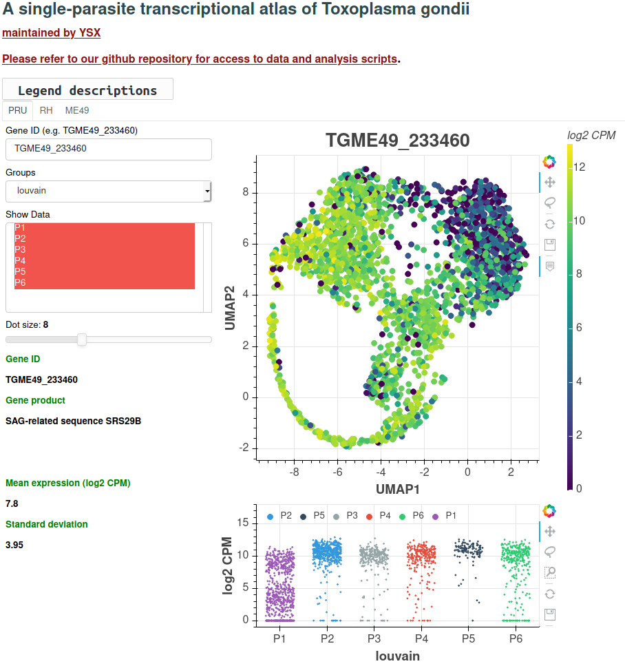

# singleToxoplasmaSeq

About
---------------------
This respository includes scripts and jupyter notebooks used to re-generate analysis results of ["A single-parasite transcriptional atlas of Toxoplasma gondii reveals novel control of antigen expression" (2020)](https://www.biorxiv.org/content/10.1101/656165v1?rss=1).

Interactive atlas
-----------------
We have also generated an interactive browser to visualize our scRNA-seq dataset. [Link here](http://st-atlas.org)



How to use
----------
Git clone this repository:
```bash
git clone https://github.com/xuesoso/singleToxoplasmaSeq
```

Then download the bundled scripts and data to the repository folder in order to regenerate analysis results and figures.
```bash
wget link 
tar -xvf Submission_analysis.tar.gz
```

** Optional **
Assuming that one has [anaconda distribution](https://www.anaconda.com/distribution/) of python, create an environment for python 3.6.8 (should work on python 3.6+).
```bash
conda create -n toxoSeq python=3.6.8 ipykernel
conda activate toxoSeq
```

** Optional **
If you just set up a new conda environment, you need to set up the jupyter kernel as well in order for jupyter notebook to run on this backend.
```bash
python -m ipykernel install --user
```

Now, install all the required python libraries.
```bash
pip install requirements.txt
```

Lastly, you can now open up the jupyter notebook and run the command to regenerate the analysis results.
```bash
jupyter-notebook ./Scripts/figures.ipynb
```

